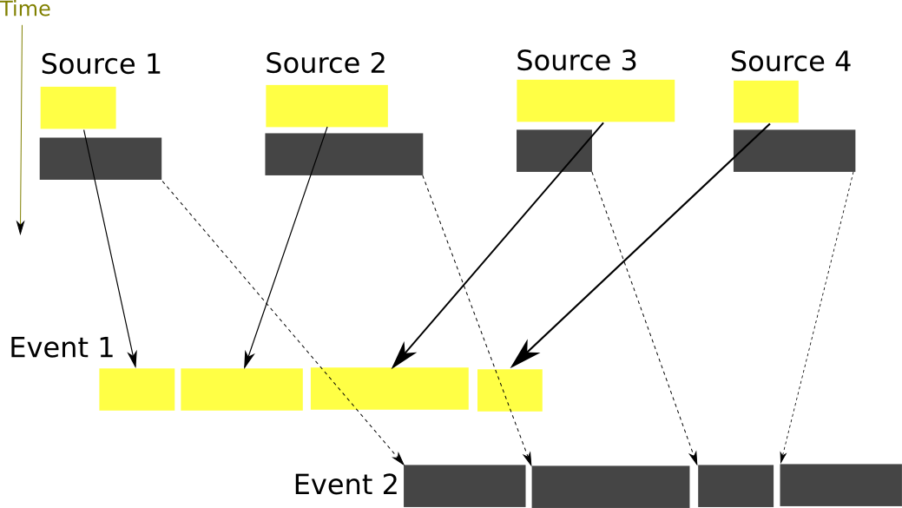
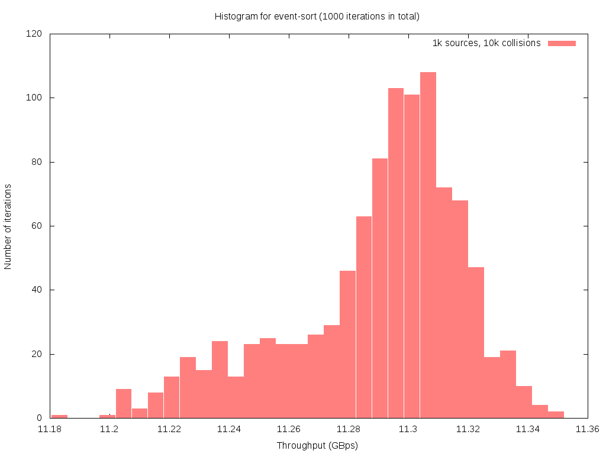
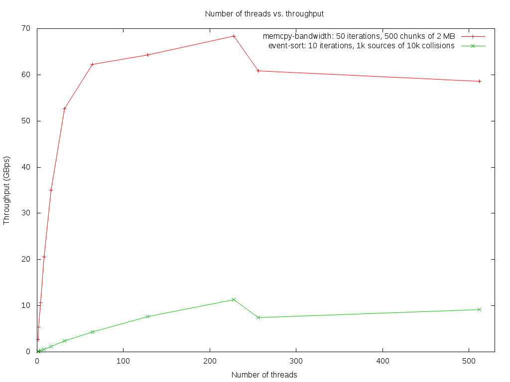

==========
EVENT SORT
==========

:Author: Karel Ha
:Contact: karel.ha@cern.ch, mathemage@gmail.com
:Created on: $Date: Tue Aug 25 2015 $

GitHub repo
-----------

Move to a folder in AFS::

  mathemage@mathemage-TTL-TEKNOPRO:~$ cd /afs/cern.ch/user/k/kha/
  mathemage@mathemage-TTL-TEKNOPRO:/afs/cern.ch/user/k/kha$ mkdir xphi-lhcb/

and clone the created repo on GitHub::

  mathemage@mathemage-TTL-TEKNOPRO:/afs/cern.ch/user/k/kha$ git clone git@github.com:mathemage/xphi-lhcb.git

Instructions
------------

Rainer instructed to simulate event sorting on Xeon Phi.

Comments on the source code
---------------------------

Code has been written for one architecture without offloads: either running entirely on host or entirely on a MIC.

main.cpp
~~~~~~~~

- `mep_factor` = number of collision that are to be currently processed (default: 1000 collisions)
- `iterations` = number of iterations, each time prefix sum and MEP copy is simulated on Xeon Phi
- `total_sources` = number of sources, i.e. 500 cards each with 2 inputs from the detector -> default:1000 sources
- `min_length`, `max_length` = lower and upper for the size of 1 collision data from 1 source
- `sources` = arrays of lengths for concatenated lengths from the first source to the last source
- `margin_factor` = how much larger should each `mep_contents[i]` be than calculated necessary size (due to statistical fluctuation)
- `mep_element_size` = size of a single fragment of collision from a single source (set as average of `min_length` and `max_length`)
- `mep_contents` = array of arrays (one per each source) containing "data-contents" from the LHCb detector
- `sorted_events` = resulting array, in which "transposed" MEP data-contents are written
- `read_offsets` = offsets from the beginning of `mep_contents[i]` for each source `i`
- `write_offsets` = offsets from the beginning `sorted_events`
- `total_time`, `read_offset_time`, `write_offset_time`, `copy_time` = durations of various parts
- `TEST_COPY_MEP_FUNCTION` = if defined, very correctnes of `copy_MEPs_*` functions
- `stopwatch_an_iteration()` = perform one iteration (modify lenghts, offset calculation, copy data...) and return total time it took
- `iteration_times`, `iteration_throughputs` = vector of durations resp. throughputs of each iteration

For other functions and variables, see `../prefix-offset/README.rst` and `../README.rst`.

Output
------

Upload to `mic0` via::

  [kha@lhcb-phi event-sort]$ ./upload-to-MIC.sh
  Using MIC0...
  icpc -g -lrt -I../../include -mmic main.cpp ../prefix-sum.cpp ../utils.cpp -o event-sort.mic.exe
  event-sort.mic.exe                                                                                 100%   40KB  40.2KB/s   00:00

  ----------SUMMARY----------
  Total elements: 2e+08
  Time for computing read_offsets: 8.91907 secs
  Time for computing write_offsets: 13.9239 secs
  Total time: 22.843 secs
  Total size: 0.4 GB
  Processed (prefix sum): 8.75543e+06 elements per second
  Throughput: 0.0175109 GBps
  ---------------------------

Non-contiguous arrays of source lengths
~~~~~~~~~~~~~~~~~~~~~~~~~~~~~~~~~~~~~~~

Compare results for various number of sources::

  [xeonphi@lhcb-phi-mic0 ~]$ ./event-sort.mic.exe -s 1 -m 10000000

  ----------SUMMARY----------
  Total elements: 2e+08
  Time for computing read_offsets: 8.91228 secs
  Time for computing write_offsets: 3.95514 secs
  Total time: 12.8674 secs
  Total size: 0.4 GB
  Processed (prefix sum): 1.55431e+07 elements per second
  Throughput: 0.0310863 GBps
  ---------------------------

  [xeonphi@lhcb-phi-mic0 ~]$ ./event-sort.mic.exe -s 2 -m 5000000

  ----------SUMMARY----------
  Total elements: 2e+08
  Time for computing read_offsets: 8.91137 secs
  Time for computing write_offsets: 6.66393 secs
  Total time: 15.5753 secs
  Total size: 0.4 GB
  Processed (prefix sum): 1.28408e+07 elements per second
  Throughput: 0.0256817 GBps
  ---------------------------

  [xeonphi@lhcb-phi-mic0 ~]$ ./event-sort.mic.exe -s 4 -m 2500000

  ----------SUMMARY----------
  Total elements: 2e+08
  Time for computing read_offsets: 8.91306 secs
  Time for computing write_offsets: 8.01962 secs
  Total time: 16.9327 secs
  Total size: 0.4 GB
  Processed (prefix sum): 1.18115e+07 elements per second
  Throughput: 0.023623 GBps
  ---------------------------

  [xeonphi@lhcb-phi-mic0 ~]$ ./event-sort.mic.exe -s 8 -m 1250000

  ----------SUMMARY----------
  Total elements: 2e+08
  Time for computing read_offsets: 8.91786 secs
  Time for computing write_offsets: 8.47783 secs
  Total time: 17.3957 secs
  Total size: 0.4 GB
  Processed (prefix sum): 1.14971e+07 elements per second
  Throughput: 0.0229942 GBps
  ---------------------------

  [xeonphi@lhcb-phi-mic0 ~]$ ./event-sort.mic.exe

  ----------SUMMARY----------
  Total elements: 2e+08
  Time for computing read_offsets: 8.91394 secs
  Time for computing write_offsets: 13.4045 secs
  Total time: 22.3184 secs
  Total size: 0.4 GB
  Processed (prefix sum): 8.96121e+06 elements per second
  Throughput: 0.0179224 GBps
  ---------------------------

The conclusion: with greater number of sources, the computation time for write_offsets deteriorates. There is a cost to having sources in non-contiguous memory::

  [xeonphi@lhcb-phi-mic2 ~]$ ./event-sort.mic.exe -s 1000 -m 1000 -i 100

  ----------SUMMARY----------
  Total elements: 2e+08
  Time for computing read_offsets: 8.90061 secs
  Time for computing write_offsets: 13.1774 secs
  Total time: 22.078 secs
  Total size: 0.4 GB
  Processed (prefix sum): 9.05879e+06 elements per second
  Throughput: 0.0181176 GBps
  ---------------------------

  [xeonphi@lhcb-phi-mic2 ~]$ ./event-sort.mic.exe -s 10000 -m 10000 -i 1  

  ----------SUMMARY----------
  Total elements: 2e+08
  Time for computing read_offsets: 9.16011 secs
  Time for computing write_offsets: 52.8355 secs
  Total time: 61.9956 secs
  Total size: 0.4 GB
  Processed (prefix sum): 3.22604e+06 elements per second
  Throughput: 0.00645207 GBps
  ---------------------------

Contiguous arrays of source lengths
~~~~~~~~~~~~~~~~~~~~~~~~~~~~~~~~~~~

When contiguous block of memory is allocated for `sources`, the time for computing `write_offsets` decreases significantly for greater number of sources::
    
  [kha@lhcb-phi event-sort]$ ssh xeonphi@mic0
  [xeonphi@lhcb-phi-mic0 ~]$ sh ./benchmarks.sh
  ./event-sort.mic.exe -s 1 -m 10000000

  ----------SUMMARY----------
  Total elements: 2e+08
  Time for computing read_offsets: 8.7282 secs
  Time for computing write_offsets: 3.95466 secs
  Total time: 12.6829 secs
  Total size: 0.4 GB
  Processed (prefix sum): 1.57693e+07 elements per second
  Throughput: 0.0315386 GBps
  ---------------------------

  ./event-sort.mic.exe -s 2 -m 5000000

  ----------SUMMARY----------
  Total elements: 2e+08
  Time for computing read_offsets: 8.72957 secs
  Time for computing write_offsets: 6.61965 secs
  Total time: 15.3492 secs
  Total size: 0.4 GB
  Processed (prefix sum): 1.303e+07 elements per second
  Throughput: 0.02606 GBps
  ---------------------------
  ./event-sort.mic.exe -s 4 -m 2500000

  ----------SUMMARY----------
  Total elements: 2e+08
  Time for computing read_offsets: 8.73222 secs
  Time for computing write_offsets: 7.95306 secs
  Total time: 16.6853 secs
  Total size: 0.4 GB
  Processed (prefix sum): 1.19866e+07 elements per second
  Throughput: 0.0239732 GBps
  ---------------------------
  ./event-sort.mic.exe -s 8 -m 1250000

  ----------SUMMARY----------
  Total elements: 2e+08
  Time for computing read_offsets: 8.72969 secs
  Time for computing write_offsets: 8.68211 secs
  Total time: 17.4118 secs
  Total size: 0.4 GB
  Processed (prefix sum): 1.14865e+07 elements per second
  Throughput: 0.0229729 GBps
  ---------------------------
  ./event-sort.mic.exe

  ----------SUMMARY----------
  Total elements: 2e+08
  Time for computing read_offsets: 8.72788 secs
  Time for computing write_offsets: 11.5977 secs
  Total time: 20.3256 secs
  Total size: 0.4 GB
  Processed (prefix sum): 9.83982e+06 elements per second
  Throughput: 0.0196796 GBps
  ---------------------------
  ./event-sort.mic.exe -s 1000 -m 1000 -i 100

  ----------SUMMARY----------
  Total elements: 2e+08
  Time for computing read_offsets: 8.71245 secs
  Time for computing write_offsets: 12.8127 secs
  Total time: 21.5252 secs
  Total size: 0.4 GB
  Processed (prefix sum): 9.29144e+06 elements per second
  Throughput: 0.0185829 GBps
  ---------------------------
  ./event-sort.mic.exe -s 10000 -m 10000 -i 1

  ----------SUMMARY----------
  Total elements: 2e+08
  Time for computing read_offsets: 8.96645 secs
  Time for computing write_offsets: 40.7559 secs
  Total time: 49.7224 secs
  Total size: 0.4 GB
  Processed (prefix sum): 4.02233e+06 elements per second
  Throughput: 0.00804467 GBps
  ---------------------------

Thus, it's better to use one linear contiguous array `length_t *sources` with appropriate index computation.

Baseline time including copy process (serial copy)
~~~~~~~~~~~~~~~~~~~~~~~~~~~~~~~~~~~~~~~~~~~~~~~~~~

The test with default arguments::

  [kha@lhcb-phi event-sort]$ ./upload-to-MIC.sh
  Using MIC0...
  icpc -g -lrt -I../../include -qopt-report3 -qopt-report-phase=vec -mmic main.cpp ../prefix-sum.cpp ../utils.cpp -o event-sort.mic.exe
  icpc: remark #10397: optimization reports are generated in *.optrpt files in the output location
  event-sort.mic.exe                                                                                 100%   40KB  40.2KB/s   00:00
  benchmarks.sh                                                                                      100%  597     0.6KB/s   00:00

  ----------SUMMARY----------
  Total elements: 1e+08
  Time for computing read_offsets: 8.72954 secs
  Time for computing write_offsets: 9.21006 secs
  Time for copying: 163.676 secs
  Total time: 181.615 secs
  Total size: 0.2 GB
  Processed: 550614 elements per second
  Throughput: 0.00110123 GBps
  ---------------------------

The benchmark script::

  [kha@lhcb-phi event-sort]$ ./upload-to-MIC.sh -b
  Running benchmarks.sh
  Using MIC0...
  icpc -g -lrt -I../../include -qopt-report3 -qopt-report-phase=vec -mmic main.cpp ../prefix-sum.cpp ../utils.cpp -o event-sort.mic.exe
  icpc: remark #10397: optimization reports are generated in *.optrpt files in the output location
  event-sort.mic.exe                                                                                 100%   40KB  40.2KB/s   00:00
  benchmarks.sh                                                                                      100%  597     0.6KB/s   00:00
  ./event-sort.mic.exe -s 1 -m 10000000
  k
  ----------SUMMARY----------
  Total elements: 1e+08
  Time for computing read_offsets: 8.72991 secs
  Time for computing write_offsets: 8.36764 secs
  Time for copying: 38.53 secs
  Total time: 55.6275 secs
  Total size: 0.2 GB
  Processed: 1.79767e+06 elements per second
  Throughput: 0.00359534 GBps
  ---------------------------
  ./event-sort.mic.exe -s 2 -m 5000000

  ----------SUMMARY----------
  Total elements: 1e+08
  Time for computing read_offsets: 8.72921 secs
  Time for computing write_offsets: 7.7414 secs
  Time for copying: 56.6856 secs
  Total time: 73.1562 secs
  Total size: 0.2 GB
  Processed: 1.36694e+06 elements per second
  Throughput: 0.00273388 GBps
  ---------------------------
  ./event-sort.mic.exe -s 4 -m 2500000

  ----------SUMMARY----------
  Total elements: 1e+08
  Time for computing read_offsets: 8.73135 secs
  Time for computing write_offsets: 7.24039 secs
  Time for copying: 64.0729 secs
  Total time: 80.0446 secs
  Total size: 0.2 GB
  Processed: 1.2493e+06 elements per second
  Throughput: 0.00249861 GBps
  ---------------------------
  ./event-sort.mic.exe -s 8 -m 1250000

  ----------SUMMARY----------
  Total elements: 1e+08
  Time for computing read_offsets: 8.72943 secs
  Time for computing write_offsets: 7.24408 secs
  Time for copying: 91.9184 secs
  Total time: 107.892 secs
  Total size: 0.2 GB
  Processed: 926854 elements per second
  Throughput: 0.00185371 GBps
  ---------------------------
  ./event-sort.mic.exe

  ----------SUMMARY----------
  Total elements: 1e+08
  Time for computing read_offsets: 8.72825 secs
  Time for computing write_offsets: 9.21279 secs
  Time for copying: 162.194 secs
  Total time: 180.135 secs
  Total size: 0.2 GB
  Processed: 555139 elements per second
  Throughput: 0.00111028 GBps
  ---------------------------
  ./event-sort.mic.exe -s 1000 -m 1000 -i 100

  ----------SUMMARY----------
  Total elements: 1e+08
  Time for computing read_offsets: 8.71094 secs
  Time for computing write_offsets: 10.4375 secs
  Time for copying: 110.073 secs
  Total time: 129.221 secs
  Total size: 0.2 GB
  Processed: 773868 elements per second
  Throughput: 0.00154774 GBps
  ---------------------------
  ./event-sort.mic.exe -s 10000 -m 10000 -i 1
  benchmarks.sh: line 9:  4715 Segmentation fault      ./event-sort.mic.exe -s 10000 -m 10000 -i 1

.. Note::

  The final test with 10000 sources and 10000 collisons fails with segmentation faults due to insufficent memory for `malloc/calloc`. This test was removed in later versions and commits.

Copy process using OpenMP parallel for
~~~~~~~~~~~~~~~~~~~~~~~~~~~~~~~~~~~~~~

The benchmarks tests with `copy_MEPs_OMP_version()`::

  [kha@lhcb-phi event-sort]$ ./upload-to-MIC.sh -b
  Running benchmarks.sh
  Using MIC0...
  icpc -g -lrt -I../../include -openmp -qopt-report3 -qopt-report-phase=vec -mmic main.cpp ../prefix-sum.cpp ../utils.cpp -o event-sort.mic.exe
  icpc: remark #10397: optimization reports are generated in *.optrpt files in the output location
  event-sort.mic.exe                                                                                 100%   47KB  47.1KB/s   00:00
  benchmarks.sh                                                                                      100%  809     0.8KB/s   00:00
  Varying the number of sources and the MEP factor...
  ./event-sort.mic.exe -s 1 -m 10000000

  ----------SUMMARY----------
  Total elements: 1e+08
  Time for computing read_offsets: 9.79635 secs
  Time for computing write_offsets: 8.27074 secs
  Time for copying: 0.933106 secs
  Total time: 19.0002 secs
  Total size: 0.2 GB
  Processed: 5.2631e+06 elements per second
  Throughput: 0.0105262 GBps
  ---------------------------
  ./event-sort.mic.exe -s 2 -m 5000000

  ----------SUMMARY----------
  Total elements: 1e+08
  Time for computing read_offsets: 9.76693 secs
  Time for computing write_offsets: 8.1456 secs
  Time for copying: 1.46524 secs
  Total time: 19.3778 secs
  Total size: 0.2 GB
  Processed: 5.16055e+06 elements per second
  Throughput: 0.0103211 GBps
  ---------------------------
  ./event-sort.mic.exe -s 4 -m 2500000

  ----------SUMMARY----------
  Total elements: 1e+08
  Time for computing read_offsets: 9.67667 secs
  Time for computing write_offsets: 7.51836 secs
  Time for copying: 1.14182 secs
  Total time: 18.3369 secs
  Total size: 0.2 GB
  Processed: 5.4535e+06 elements per second
  Throughput: 0.010907 GBps
  ---------------------------
  ./event-sort.mic.exe -s 8 -m 1250000

  ----------SUMMARY----------
  Total elements: 1e+08
  Time for computing read_offsets: 9.55109 secs
  Time for computing write_offsets: 7.41747 secs
  Time for copying: 1.91172 secs
  Total time: 18.8803 secs
  Total size: 0.2 GB
  Processed: 5.29653e+06 elements per second
  Throughput: 0.0105931 GBps
  ---------------------------
  ./event-sort.mic.exe

  ----------SUMMARY----------
  Total elements: 1e+08
  Time for computing read_offsets: 9.53512 secs
  Time for computing write_offsets: 9.70429 secs
  Time for copying: 2.60347 secs
  Total time: 21.8429 secs
  Total size: 0.2 GB
  Processed: 4.57815e+06 elements per second
  Throughput: 0.0091563 GBps
  ---------------------------
  ./event-sort.mic.exe -s 1000 -m 1000 -i 100

  ----------SUMMARY----------
  Total elements: 1e+08
  Time for computing read_offsets: 12.4295 secs
  Time for computing write_offsets: 13.0162 secs
  Time for copying: 3.43399 secs
  Total time: 28.8797 secs
  Total size: 0.2 GB
  Processed: 3.46264e+06 elements per second
  Throughput: 0.00692528 GBps
  ---------------------------

  Varying the number of iterations...
  ./event-sort.mic.exe -i 1

  ----------SUMMARY----------
  Total elements: 1e+07
  Time for computing read_offsets: 0.906232 secs
  Time for computing write_offsets: 1.00157 secs
  Time for copying: 0.403936 secs
  Total time: 2.31174 secs
  Total size: 0.02 GB
  Processed: 4.32575e+06 elements per second
  Throughput: 0.0086515 GBps
  ---------------------------
  ./event-sort.mic.exe -i 10

  ----------SUMMARY----------
  Total elements: 1e+08
  Time for computing read_offsets: 9.68235 secs
  Time for computing write_offsets: 9.702 secs
  Time for copying: 1.82603 secs
  Total time: 21.2104 secs
  Total size: 0.2 GB
  Processed: 4.71467e+06 elements per second
  Throughput: 0.00942935 GBps
  ---------------------------
  ./event-sort.mic.exe -i 100

  ----------SUMMARY----------
  Total elements: 1e+09
  Time for computing read_offsets: 96.8748 secs
  Time for computing write_offsets: 92.9315 secs
  Time for copying: 16.279 secs
  Total time: 206.085 secs
  Total size: 2 GB
  Processed: 4.85236e+06 elements per second
  Throughput: 0.00970472 GBps
  ---------------------------
  ./event-sort.mic.exe -i 200

  ----------SUMMARY----------
  Total elements: 2e+09
  Time for computing read_offsets: 192.967 secs
  Time for computing write_offsets: 185.879 secs
  Time for copying: 31.6881 secs
  Total time: 410.534 secs
  Total size: 4 GB
  Processed: 4.8717e+06 elements per second
  Throughput: 0.0097434 GBps
  ---------------------------

Prefix-sum for read_offsets using OpenMP parallel for
~~~~~~~~~~~~~~~~~~~~~~~~~~~~~~~~~~~~~~~~~~~~~~~~~~~~~

The benchmarks tests with `get_read_offsets_OMP_version()`::

  [kha@lhcb-phi event-sort]$ ./upload-to-MIC.sh -b
  Running benchmarks.sh
  Using MIC0...
  icpc -g -lrt -I../../include -openmp -qopt-report3 -qopt-report-phase=vec -mmic main.cpp ../prefix-sum.cpp ../utils.cpp -o event-sort.mic.exe
  icpc: remark #10397: optimization reports are generated in *.optrpt files in the output location
  event-sort.mic.exe                                                                                 100%   49KB  48.9KB/s   00:00
  benchmarks.sh                                                                                      100%  898     0.9KB/s   00:00
  Varying the number of sources and the MEP factor...
  ./event-sort.mic.exe -s 1 -m 10000000

  ----------SUMMARY----------
  Total elements: 1e+08
  Time for computing read_offsets: 10.2022 secs
  Time for computing write_offsets: 8.27889 secs
  Time for copying: 0.720112 secs
  Total time: 19.2012 secs
  Total size: 0.2 GB
  Processed: 5.20802e+06 elements per second
  Throughput: 0.010416 GBps
  ---------------------------
  ./event-sort.mic.exe -s 2 -m 5000000

  ----------SUMMARY----------
  Total elements: 1e+08
  Time for computing read_offsets: 5.75686 secs
  Time for computing write_offsets: 8.09037 secs
  Time for copying: 0.925127 secs
  Total time: 14.7724 secs
  Total size: 0.2 GB
  Processed: 6.7694e+06 elements per second
  Throughput: 0.0135388 GBps
  ---------------------------
  ./event-sort.mic.exe -s 4 -m 2500000

  ----------SUMMARY----------
  Total elements: 1e+08
  Time for computing read_offsets: 3.32101 secs
  Time for computing write_offsets: 7.6416 secs
  Time for copying: 0.944015 secs
  Total time: 11.9066 secs
  Total size: 0.2 GB
  Processed: 8.39868e+06 elements per second
  Throughput: 0.0167974 GBps
  ---------------------------
  ./event-sort.mic.exe -s 8 -m 1250000

  ----------SUMMARY----------
  Total elements: 1e+08
  Time for computing read_offsets: 1.81216 secs
  Time for computing write_offsets: 8.13353 secs
  Time for copying: 1.00086 secs
  Total time: 10.9465 secs
  Total size: 0.2 GB
  Processed: 9.1353e+06 elements per second
  Throughput: 0.0182706 GBps
  ---------------------------
  ./event-sort.mic.exe

  ----------SUMMARY----------
  Total elements: 1e+08
  Time for computing read_offsets: 0.401581 secs
  Time for computing write_offsets: 10.4987 secs
  Time for copying: 1.18386 secs
  Total time: 12.0841 secs
  Total size: 0.2 GB
  Processed: 8.27533e+06 elements per second
  Throughput: 0.0165507 GBps
  ---------------------------
  ./event-sort.mic.exe -s 1000 -m 1000 -i 100

  ----------SUMMARY----------
  Total elements: 1e+08
  Time for computing read_offsets: 0.375774 secs
  Time for computing write_offsets: 13.0442 secs
  Time for copying: 1.10754 secs
  Total time: 14.5275 secs
  Total size: 0.2 GB
  Processed: 6.88348e+06 elements per second
  Throughput: 0.013767 GBps
  ---------------------------

  Varying the number of iterations...
  ./event-sort.mic.exe -i 1

  ----------SUMMARY----------
  Total elements: 1e+07
  Time for computing read_offsets: 0.245701 secs
  Time for computing write_offsets: 1.05357 secs
  Time for copying: 0.187311 secs
  Total time: 1.48658 secs
  Total size: 0.02 GB
  Processed: 6.72685e+06 elements per second
  Throughput: 0.0134537 GBps
  ---------------------------
  ./event-sort.mic.exe -i 10

  ----------SUMMARY----------
  Total elements: 1e+08
  Time for computing read_offsets: 0.378384 secs
  Time for computing write_offsets: 10.4223 secs
  Time for copying: 1.17968 secs
  Total time: 11.9803 secs
  Total size: 0.2 GB
  Processed: 8.34702e+06 elements per second
  Throughput: 0.016694 GBps
  ---------------------------
  ./event-sort.mic.exe -i 100

  ----------SUMMARY----------
  Total elements: 1e+09
  Time for computing read_offsets: 1.79359 secs
  Time for computing write_offsets: 104.249 secs
  Time for copying: 11.1246 secs
  Total time: 117.167 secs
  Total size: 2 GB
  Processed: 8.53484e+06 elements per second
  Throughput: 0.0170697 GBps
  ---------------------------
  ./event-sort.mic.exe -i 200

  ----------SUMMARY----------
  Total elements: 2e+09
  Time for computing read_offsets: 3.34835 secs
  Time for computing write_offsets: 200.013 secs
  Time for copying: 22.3177 secs
  Total time: 225.679 secs
  Total size: 4 GB
  Processed: 8.86215e+06 elements per second
  Throughput: 0.0177243 GBps
  ---------------------------

Prefix-sum for write_offsets using OpenMP parallel for
~~~~~~~~~~~~~~~~~~~~~~~~~~~~~~~~~~~~~~~~~~~~~~~~~~~~~~

The benchmarks tests with `get_write_offsets_OMP_vesion()`::

  [kha@lhcb-phi event-sort]$ ./upload-to-MIC.sh -b
  Running benchmarks.sh
  Using MIC0...
  icpc -g -lrt -I../../include -openmp -qopt-report3 -qopt-report-phase=vec -mmic main.cpp ../prefix-sum.cpp ../utils.cpp -o event-sort.mic.exe
  icpc: remark #10397: optimization reports are generated in *.optrpt files in the output location
  event-sort.mic.exe                                                                                 100%   54KB  53.9KB/s   00:00
  benchmarks.sh                                                                                      100%  898     0.9KB/s   00:00
  Varying the number of sources and the MEP factor...
  ./event-sort.mic.exe -s 1 -m 10000000

  ----------SUMMARY----------
  Total elements: 1e+08
  Time for computing read_offsets: 9.99205 secs
  Time for computing write_offsets: 0.228972 secs
  Time for copying: 0.772912 secs
  Total time: 10.9939 secs
  Total size: 0.2 GB
  Processed: 9.09592e+06 elements per second
  Throughput: 0.0181918 GBps
  ---------------------------
  ./event-sort.mic.exe -s 2 -m 5000000

  ----------SUMMARY----------
  Total elements: 1e+08
  Time for computing read_offsets: 5.78715 secs
  Time for computing write_offsets: 0.222349 secs
  Time for copying: 0.941591 secs
  Total time: 6.95109 secs
  Total size: 0.2 GB
  Processed: 1.43862e+07 elements per second
  Throughput: 0.0287725 GBps
  ---------------------------
  ./event-sort.mic.exe -s 4 -m 2500000

  ----------SUMMARY----------
  Total elements: 1e+08
  Time for computing read_offsets: 3.46175 secs
  Time for computing write_offsets: 0.20651 secs
  Time for copying: 0.953377 secs
  Total time: 4.62164 secs
  Total size: 0.2 GB
  Processed: 2.16374e+07 elements per second
  Throughput: 0.0432747 GBps
  ---------------------------
  ./event-sort.mic.exe -s 8 -m 1250000

  ----------SUMMARY----------
  Total elements: 1e+08
  Time for computing read_offsets: 1.88861 secs
  Time for computing write_offsets: 0.196537 secs
  Time for copying: 1.01361 secs
  Total time: 3.09876 secs
  Total size: 0.2 GB
  Processed: 3.2271e+07 elements per second
  Throughput: 0.064542 GBps
  ---------------------------
  ./event-sort.mic.exe

  ----------SUMMARY----------
  Total elements: 1e+08
  Time for computing read_offsets: 0.397247 secs
  Time for computing write_offsets: 0.293296 secs
  Time for copying: 1.22363 secs
  Total time: 1.91418 secs
  Total size: 0.2 GB
  Processed: 5.22418e+07 elements per second
  Throughput: 0.104484 GBps
  ---------------------------
  ./event-sort.mic.exe -s 1000 -m 1000 -i 100

  ----------SUMMARY----------
  Total elements: 1e+08
  Time for computing read_offsets: 0.38787 secs
  Time for computing write_offsets: 0.347369 secs
  Time for copying: 1.13767 secs
  Total time: 1.87291 secs
  Total size: 0.2 GB
  Processed: 5.33929e+07 elements per second
  Throughput: 0.106786 GBps
  ---------------------------

  Varying the number of iterations...
  ./event-sort.mic.exe -i 1

  ----------SUMMARY----------
  Total elements: 1e+07
  Time for computing read_offsets: 0.23832 secs
  Time for computing write_offsets: 0.0367888 secs
  Time for copying: 0.196166 secs
  Total time: 0.471275 secs
  Total size: 0.02 GB
  Processed: 2.1219e+07 elements per second
  Throughput: 0.042438 GBps
  ---------------------------
  ./event-sort.mic.exe -i 10

  ----------SUMMARY----------
  Total elements: 1e+08
  Time for computing read_offsets: 0.402601 secs
  Time for computing write_offsets: 0.296985 secs
  Time for copying: 1.22022 secs
  Total time: 1.9198 secs
  Total size: 0.2 GB
  Processed: 5.20887e+07 elements per second
  Throughput: 0.104177 GBps
  ---------------------------
  ./event-sort.mic.exe -i 100

  ----------SUMMARY----------
  Total elements: 1e+09
  Time for computing read_offsets: 1.86989 secs
  Time for computing write_offsets: 2.8893 secs
  Time for copying: 11.4858 secs
  Total time: 16.245 secs
  Total size: 2 GB
  Processed: 6.15573e+07 elements per second
  Throughput: 0.123115 GBps
  ---------------------------
  ./event-sort.mic.exe -i 200

  ----------SUMMARY----------
  Total elements: 2e+09
  Time for computing read_offsets: 3.48713 secs
  Time for computing write_offsets: 5.78911 secs
  Time for copying: 22.9099 secs
  Total time: 32.1862 secs
  Total size: 4 GB
  Processed: 6.21385e+07 elements per second
  Throughput: 0.124277 GBps
  ---------------------------

Correct throughput computation
~~~~~~~~~~~~~~~~~~~~~~~~~~~~~~

The benchmarks tests after fixing throughput and total size computation (counting the size of contents, not just their lengths)::

  [kha@lhcb-phi event-sort]$ ./upload-to-MIC.sh -b
  Running benchmarks.sh
  Using MIC0...
  icpc -g -lrt -I../../include -openmp -qopt-report3 -qopt-report-phase=vec -mmic main.cpp ../prefix-sum.cpp ../utils.cpp -o event-sort.mic.exe
  icpc: remark #10397: optimization reports are generated in *.optrpt files in the output location
  event-sort.mic.exe                                                                                 100%   54KB  53.9KB/s   00:00
  benchmarks.sh                                                                                      100%  898     0.9KB/s   00:00
  Varying the number of sources and the MEP factor...
  ./event-sort.mic.exe -s 1 -m 10000000

  ----------SUMMARY----------
  Total elements: 1e+08
  Time for computing read_offsets: 10.0119 secs
  Time for computing write_offsets: 0.229137 secs
  Time for copying: 0.743621 secs
  Total time: 10.9847 secs
  Total size: 11.4994 GB
  Processed: 9.10357e+06 elements per second
  Throughput: 1.04686 GBps
  ---------------------------
  ./event-sort.mic.exe -s 2 -m 5000000

  ----------SUMMARY----------
  Total elements: 1e+08
  Time for computing read_offsets: 5.79486 secs
  Time for computing write_offsets: 0.220166 secs
  Time for copying: 0.946193 secs
  Total time: 6.96121 secs
  Total size: 11.4997 GB
  Processed: 1.43653e+07 elements per second
  Throughput: 1.65197 GBps
  ---------------------------
  ./event-sort.mic.exe -s 4 -m 2500000

  ----------SUMMARY----------
  Total elements: 1e+08
  Time for computing read_offsets: 3.45985 secs
  Time for computing write_offsets: 0.208394 secs
  Time for copying: 0.955895 secs
  Total time: 4.62414 secs
  Total size: 11.4992 GB
  Processed: 2.16256e+07 elements per second
  Throughput: 2.48677 GBps
  ---------------------------
  ./event-sort.mic.exe -s 8 -m 1250000

  ----------SUMMARY----------
  Total elements: 1e+08
  Time for computing read_offsets: 1.89305 secs
  Time for computing write_offsets: 0.194279 secs
  Time for copying: 1.0116 secs
  Total time: 3.09893 secs
  Total size: 11.5002 GB
  Processed: 3.22692e+07 elements per second
  Throughput: 3.71103 GBps
  ---------------------------
  ./event-sort.mic.exe

  ----------SUMMARY----------
  Total elements: 1e+08
  Time for computing read_offsets: 0.39601 secs
  Time for computing write_offsets: 0.292883 secs
  Time for copying: 1.23066 secs
  Total time: 1.91955 secs
  Total size: 11.4988 GB
  Processed: 5.20954e+07 elements per second
  Throughput: 5.99033 GBps
  ---------------------------
  ./event-sort.mic.exe -s 1000 -m 1000 -i 100

  ----------SUMMARY----------
  Total elements: 1e+08
  Time for computing read_offsets: 0.389456 secs
  Time for computing write_offsets: 0.319981 secs
  Time for copying: 1.13655 secs
  Total time: 1.84599 secs
  Total size: 11.5007 GB
  Processed: 5.41714e+07 elements per second
  Throughput: 6.23007 GBps
  ---------------------------

  Varying the number of iterations...
  ./event-sort.mic.exe -i 1

  ----------SUMMARY----------
  Total elements: 1e+07
  Time for computing read_offsets: 0.246554 secs
  Time for computing write_offsets: 0.0361512 secs
  Time for copying: 0.202222 secs
  Total time: 0.484927 secs
  Total size: 1.14996 GB
  Processed: 2.06216e+07 elements per second
  Throughput: 2.37141 GBps
  ---------------------------
  ./event-sort.mic.exe -i 10

  ----------SUMMARY----------
  Total elements: 1e+08
  Time for computing read_offsets: 0.395527 secs
  Time for computing write_offsets: 0.29709 secs
  Time for copying: 1.22107 secs
  Total time: 1.91369 secs
  Total size: 11.4996 GB
  Processed: 5.22551e+07 elements per second
  Throughput: 6.00911 GBps
  ---------------------------
  ./event-sort.mic.exe -i 100

  ----------SUMMARY----------
  Total elements: 1e+09
  Time for computing read_offsets: 1.85257 secs
  Time for computing write_offsets: 2.88706 secs
  Time for copying: 11.4893 secs
  Total time: 16.229 secs
  Total size: 115.004 GB
  Processed: 6.16182e+07 elements per second
  Throughput: 7.08631 GBps
  ---------------------------
  ./event-sort.mic.exe -i 200

  ----------SUMMARY----------
  Total elements: 2e+09
  Time for computing read_offsets: 3.46938 secs
  Time for computing write_offsets: 5.79868 secs
  Time for copying: 22.8545 secs
  Total time: 32.1226 secs
  Total size: 230 GB
  Processed: 6.22615e+07 elements per second
  Throughput: 7.16008 GBps
  ---------------------------

Histogram and statistics
~~~~~~~~~~~~~~~~~~~~~~~~

The benchmarks tests with some statistics and histogram of time durations per each iteration::

  [kha@lhcb-phi event-sort]$ ./upload-to-MIC.sh -b
  Running benchmarks.sh
  Using MIC0...
  icpc -g -lrt -I../../include -openmp -std=c++14 -qopt-report3 -qopt-report-phase=vec -mmic main.cpp ../prefix-sum.cpp ../utils.cpp -o event-sort.mic.exe
  icpc: remark #10397: optimization reports are generated in *.optrpt files in the output location
  event-sort.mic.exe                                                                                 100%  133KB 133.4KB/s   00:00
  benchmarks.sh                                                                                      100%  898     0.9KB/s   00:00
  libiomp5.so                                                                                        100% 1268KB   1.2MB/s   00:00
  Varying the number of sources and the MEP factor...
  ./event-sort.mic.exe -s 1 -m 10000000

  --------STATISTICS OF TIME INTERVALS--------
  min: 1.05950 secs
  max: 1.32880 secs
  mean: 1.10028 secs
  Histogram:
  [1.05950, 1.12682): 9 times
  [1.12682, 1.19415): 0 times
  [1.19415, 1.26147): 0 times
  [1.26147, 1.32880): 1 times
  --------------------------------------------
  ----------SUMMARY----------
  Total elements: 1e+08
  Time for computing read_offsets: 10.0275 secs
  Time for computing write_offsets: 0.230594 secs
  Time for copying: 0.744695 secs
  Total time: 11.0028 secs
  Total size: 11.4999 GB
  Processed: 9.08864e+06 elements per second
  Throughput: 1.04519 GBps
  ---------------------------
  ./event-sort.mic.exe -s 2 -m 5000000

  --------STATISTICS OF TIME INTERVALS--------
  min: 0.64116 secs
  max: 0.90048 secs
  mean: 0.69423 secs
  Histogram:
  [0.64116, 0.70599): 9 times
  [0.70599, 0.77082): 0 times
  [0.77082, 0.83565): 0 times
  [0.83565, 0.90048): 1 times
  --------------------------------------------
  ----------SUMMARY----------
  Total elements: 1e+08
  Time for computing read_offsets: 5.77213 secs
  Time for computing write_offsets: 0.221306 secs
  Time for copying: 0.94891 secs
  Total time: 6.94235 secs
  Total size: 11.4992 GB
  Processed: 1.44043e+07 elements per second
  Throughput: 1.65638 GBps
  ---------------------------
  ./event-sort.mic.exe -s 4 -m 2500000

  --------STATISTICS OF TIME INTERVALS--------
  min: 0.42638 secs
  max: 0.68698 secs
  mean: 0.46065 secs
  Histogram:
  [0.42638, 0.49153): 9 times
  [0.49153, 0.55668): 0 times
  [0.55668, 0.62183): 0 times
  [0.62183, 0.68698): 1 times
  --------------------------------------------
  ----------SUMMARY----------
  Total elements: 1e+08
  Time for computing read_offsets: 3.44524 secs
  Time for computing write_offsets: 0.207096 secs
  Time for copying: 0.954154 secs
  Total time: 4.60649 secs
  Total size: 11.5008 GB
  Processed: 2.17085e+07 elements per second
  Throughput: 2.49666 GBps
  ---------------------------
  ./event-sort.mic.exe -s 8 -m 1250000

  --------STATISTICS OF TIME INTERVALS--------
  min: 0.27765 secs
  max: 0.57929 secs
  mean: 0.30888 secs
  Histogram:
  [0.27765, 0.35306): 9 times
  [0.35306, 0.42847): 0 times
  [0.42847, 0.50388): 0 times
  [0.50388, 0.57929): 1 times
  --------------------------------------------
  ----------SUMMARY----------
  Total elements: 1e+08
  Time for computing read_offsets: 1.88406 secs
  Time for computing write_offsets: 0.195166 secs
  Time for copying: 1.00954 secs
  Total time: 3.08877 secs
  Total size: 11.5003 GB
  Processed: 3.23754e+07 elements per second
  Throughput: 3.72328 GBps
  ---------------------------
  ./event-sort.mic.exe

  --------STATISTICS OF TIME INTERVALS--------
  min: 0.15876 secs
  max: 0.48001 secs
  mean: 0.19157 secs
  Histogram:
  [0.15876, 0.23908): 9 times
  [0.23908, 0.31939): 0 times
  [0.31939, 0.39970): 0 times
  [0.39970, 0.48001): 1 times
  --------------------------------------------
  ----------SUMMARY----------
  Total elements: 1e+08
  Time for computing read_offsets: 0.392248 secs
  Time for computing write_offsets: 0.300912 secs
  Time for copying: 1.22255 secs
  Total time: 1.91571 secs
  Total size: 11.4992 GB
  Processed: 5.22001e+07 elements per second
  Throughput: 6.00257 GBps
  ---------------------------
  ./event-sort.mic.exe -s 1000 -m 1000 -i 100

  --------STATISTICS OF TIME INTERVALS--------
  min: 0.01583 secs
  max: 0.25273 secs
  mean: 0.01867 secs
  Histogram:
  [0.01583, 0.03952): 99 times
  [0.03952, 0.06321): 0 times
  [0.06321, 0.08690): 0 times
  [0.08690, 0.11059): 0 times
  [0.11059, 0.13428): 0 times
  [0.13428, 0.15797): 0 times
  [0.15797, 0.18166): 0 times
  [0.18166, 0.20535): 0 times
  [0.20535, 0.22904): 0 times
  [0.22904, 0.25273): 1 times
  --------------------------------------------
  ----------SUMMARY----------
  Total elements: 1e+08
  Time for computing read_offsets: 0.382261 secs
  Time for computing write_offsets: 0.342993 secs
  Time for copying: 1.14151 secs
  Total time: 1.86677 secs
  Total size: 11.5029 GB
  Processed: 5.35686e+07 elements per second
  Throughput: 6.16193 GBps
  ---------------------------

  Varying the number of iterations...
  ./event-sort.mic.exe -i 1

  --------STATISTICS OF TIME INTERVALS--------
  min: 0.47848 secs
  max: 0.47848 secs
  mean: 0.47848 secs
  Histogram:
  [0.47848, 0.47848): 1 times
  --------------------------------------------
  ----------SUMMARY----------
  Total elements: 1e+07
  Time for computing read_offsets: 0.244454 secs
  Time for computing write_offsets: 0.0372003 secs
  Time for copying: 0.196824 secs
  Total time: 0.478478 secs
  Total size: 1.14999 GB
  Processed: 2.08996e+07 elements per second
  Throughput: 2.40343 GBps
  ---------------------------
  ./event-sort.mic.exe -i 10

  --------STATISTICS OF TIME INTERVALS--------
  min: 0.15843 secs
  max: 0.48001 secs
  mean: 0.19085 secs
  Histogram:
  [0.15843, 0.23883): 9 times
  [0.23883, 0.31922): 0 times
  [0.31922, 0.39962): 0 times
  [0.39962, 0.48001): 1 times
  --------------------------------------------
  ----------SUMMARY----------
  Total elements: 1e+08
  Time for computing read_offsets: 0.391939 secs
  Time for computing write_offsets: 0.293104 secs
  Time for copying: 1.22345 secs
  Total time: 1.90849 secs
  Total size: 11.4995 GB
  Processed: 5.23973e+07 elements per second
  Throughput: 6.02545 GBps
  ---------------------------
  ./event-sort.mic.exe -i 100

  --------STATISTICS OF TIME INTERVALS--------
  min: 0.15838 secs
  max: 0.47456 secs
  mean: 0.16239 secs
  Histogram:
  [0.15838, 0.19000): 99 times
  [0.19000, 0.22162): 0 times
  [0.22162, 0.25324): 0 times
  [0.25324, 0.28485): 0 times
  [0.28485, 0.31647): 0 times
  [0.31647, 0.34809): 0 times
  [0.34809, 0.37971): 0 times
  [0.37971, 0.41133): 0 times
  [0.41133, 0.44294): 0 times
  [0.44294, 0.47456): 1 times
  --------------------------------------------
  ----------SUMMARY----------
  Total elements: 1e+09
  Time for computing read_offsets: 1.85009 secs
  Time for computing write_offsets: 2.89138 secs
  Time for copying: 11.4978 secs
  Total time: 16.2392 secs
  Total size: 115.011 GB
  Processed: 6.15792e+07 elements per second
  Throughput: 7.0823 GBps
  ---------------------------
  ./event-sort.mic.exe -i 200

  --------STATISTICS OF TIME INTERVALS--------
  min: 0.15824 secs
  max: 0.47081 secs
  mean: 0.16068 secs
  Histogram:
  [0.15824, 0.17908): 199 times
  [0.17908, 0.19991): 0 times
  [0.19991, 0.22075): 0 times
  [0.22075, 0.24159): 0 times
  [0.24159, 0.26243): 0 times
  [0.26243, 0.28327): 0 times
  [0.28327, 0.30411): 0 times
  [0.30411, 0.32494): 0 times
  [0.32494, 0.34578): 0 times
  [0.34578, 0.36662): 0 times
  [0.36662, 0.38746): 0 times
  [0.38746, 0.40830): 0 times
  [0.40830, 0.42914): 0 times
  [0.42914, 0.44997): 0 times
  [0.44997, 0.47081): 1 times
  --------------------------------------------
  ----------SUMMARY----------
  Total elements: 2e+09
  Time for computing read_offsets: 3.49072 secs
  Time for computing write_offsets: 5.75852 secs
  Time for copying: 22.8868 secs
  Total time: 32.1361 secs
  Total size: 229.982 GB
  Processed: 6.22354e+07 elements per second
  Throughput: 7.15652 GBps
  ---------------------------

Statistics discarding the initial iteration
~~~~~~~~~~~~~~~~~~~~~~~~~~~~~~~~~~~~~~~~~~~

The benchmarks tests which does not include the first iteration into the statistics::

  [kha@lhcb-phi event-sort]$ ./upload-to-MIC.sh -b
  Running benchmarks.sh
  Using MIC0...
  icpc -g -lrt -I../../include -openmp -std=c++14 -qopt-report3 -qopt-report-phase=vec -mmic main.cpp ../prefix-sum.cpp ../utils.cpp -o event-sort.mic.exe
  icpc: remark #10397: optimization reports are generated in *.optrpt files in the output location
  event-sort.mic.exe                                                                                 100%  143KB 142.6KB/s   00:00
  benchmarks.sh                                                                                      100%  898     0.9KB/s   00:00
  libiomp5.so                                                                                        100% 1268KB   1.2MB/s   00:00
  Varying the number of sources and the MEP factor...
  ./event-sort.mic.exe -s 1 -m 10000000

  --------STATISTICS OF TIME INTERVALS--------
  The initial iteration: 1.32541 secs
  min: 1.06163 secs
  max: 1.10071 secs
  mean: 1.07143 secs
  Histogram:
  [1.06163, 1.07140): 7 times
  [1.07140, 1.08117): 1 times
  [1.08117, 1.09094): 1 times
  [1.09094, 1.10071): 1 times
  --------------------------------------------
  ----------SUMMARY----------
  Total elements: 1e+08
  Time for computing read_offsets: 9.76519 secs
  Time for computing write_offsets: 0.221946 secs
  Time for copying: 0.727193 secs
  Total time: 10.7143 secs
  Total size: 11.5 GB
  Processed: 9.3333e+06 elements per second
  Throughput: 1.07333 GBps
  ---------------------------
  ./event-sort.mic.exe -s 2 -m 5000000

  --------STATISTICS OF TIME INTERVALS--------
  The initial iteration: 0.90188 secs
  min: 0.62922 secs
  max: 0.69683 secs
  mean: 0.66163 secs
  Histogram:
  [0.62922, 0.64613): 4 times
  [0.64613, 0.66303): 1 times
  [0.66303, 0.67993): 2 times
  [0.67993, 0.69683): 3 times
  --------------------------------------------
  ----------SUMMARY----------
  Total elements: 1e+08
  Time for computing read_offsets: 5.47646 secs
  Time for computing write_offsets: 0.213602 secs
  Time for copying: 0.926254 secs
  Total time: 6.61631 secs
  Total size: 11.5 GB
  Processed: 1.51142e+07 elements per second
  Throughput: 1.73814 GBps
  ---------------------------
  ./event-sort.mic.exe -s 4 -m 2500000

  --------STATISTICS OF TIME INTERVALS--------
  The initial iteration: 0.74336 secs
  min: 0.42776 secs
  max: 0.44565 secs
  mean: 0.43536 secs
  Histogram:
  [0.42776, 0.43223): 3 times
  [0.43223, 0.43671): 3 times
  [0.43671, 0.44118): 3 times
  [0.44118, 0.44565): 1 times
  --------------------------------------------
  ----------SUMMARY----------
  Total elements: 1e+08
  Time for computing read_offsets: 3.23586 secs
  Time for computing write_offsets: 0.200783 secs
  Time for copying: 0.917004 secs
  Total time: 4.35365 secs
  Total size: 11.5007 GB
  Processed: 2.29693e+07 elements per second
  Throughput: 2.64163 GBps
  ---------------------------
  ./event-sort.mic.exe -s 8 -m 1250000

  --------STATISTICS OF TIME INTERVALS--------
  The initial iteration: 0.58039 secs
  min: 0.27776 secs
  max: 0.27956 secs
  mean: 0.27912 secs
  Histogram:
  [0.27776, 0.27821): 1 times
  [0.27821, 0.27866): 1 times
  [0.27866, 0.27911): 1 times
  [0.27911, 0.27956): 7 times
  --------------------------------------------
  ----------SUMMARY----------
  Total elements: 1e+08
  Time for computing read_offsets: 1.65574 secs
  Time for computing write_offsets: 0.187871 secs
  Time for copying: 0.947603 secs
  Total time: 2.79121 secs
  Total size: 11.5002 GB
  Processed: 3.58267e+07 elements per second
  Throughput: 4.12013 GBps
  ---------------------------
  ./event-sort.mic.exe

  --------STATISTICS OF TIME INTERVALS--------
  The initial iteration: 0.47676 secs
  min: 0.15856 secs
  max: 0.15935 secs
  mean: 0.15896 secs
  Histogram:
  [0.15856, 0.15876): 1 times
  [0.15876, 0.15896): 4 times
  [0.15896, 0.15915): 3 times
  [0.15915, 0.15935): 2 times
  --------------------------------------------
  ----------SUMMARY----------
  Total elements: 1e+08
  Time for computing read_offsets: 0.164303 secs
  Time for computing write_offsets: 0.288554 secs
  Time for copying: 1.13675 secs
  Total time: 1.58961 secs
  Total size: 11.4998 GB
  Processed: 6.29086e+07 elements per second
  Throughput: 7.23434 GBps
  ---------------------------
  ./event-sort.mic.exe -s 1000 -m 1000 -i 100

  --------STATISTICS OF TIME INTERVALS--------
  The initial iteration: 0.26013 secs
  min: 0.01560 secs
  max: 0.01681 secs
  mean: 0.01604 secs
  Histogram:
  [0.01560, 0.01572): 29 times
  [0.01572, 0.01584): 1 times
  [0.01584, 0.01596): 3 times
  [0.01596, 0.01609): 1 times
  [0.01609, 0.01621): 43 times
  [0.01621, 0.01633): 10 times
  [0.01633, 0.01645): 9 times
  [0.01645, 0.01657): 2 times
  [0.01657, 0.01669): 1 times
  [0.01669, 0.01681): 1 times
  --------------------------------------------
  ----------SUMMARY----------
  Total elements: 1e+08
  Time for computing read_offsets: 0.171142 secs
  Time for computing write_offsets: 0.315524 secs
  Time for copying: 1.1176 secs
  Total time: 1.60426 secs
  Total size: 11.5006 GB
  Processed: 6.2334e+07 elements per second
  Throughput: 7.1688 GBps
  ---------------------------

  Varying the number of iterations...
  ./event-sort.mic.exe -i 1

  --------STATISTICS OF TIME INTERVALS--------
  The initial iteration: 0.47896 secs
  min: 0.15926 secs
  max: 0.15926 secs
  mean: 0.15926 secs
  Histogram:
  [0.15926, 0.15926): 1 times
  --------------------------------------------
  ----------SUMMARY----------
  Total elements: 1e+07
  Time for computing read_offsets: 0.0160031 secs
  Time for computing write_offsets: 0.0288499 secs
  Time for copying: 0.114403 secs
  Total time: 0.159256 secs
  Total size: 1.14992 GB
  Processed: 6.27919e+07 elements per second
  Throughput: 7.22059 GBps
  ---------------------------
  ./event-sort.mic.exe -i 10

  --------STATISTICS OF TIME INTERVALS--------
  The initial iteration: 0.48201 secs
  min: 0.15918 secs
  max: 0.16195 secs
  mean: 0.15974 secs
  Histogram:
  [0.15918, 0.15987): 8 times
  [0.15987, 0.16057): 1 times
  [0.16057, 0.16126): 0 times
  [0.16126, 0.16195): 1 times
  --------------------------------------------
  ----------SUMMARY----------
  Total elements: 1e+08
  Time for computing read_offsets: 0.160308 secs
  Time for computing write_offsets: 0.288843 secs
  Time for copying: 1.1483 secs
  Total time: 1.59745 secs
  Total size: 11.5002 GB
  Processed: 6.25999e+07 elements per second
  Throughput: 7.19909 GBps
  ---------------------------
  ./event-sort.mic.exe -i 100

  --------STATISTICS OF TIME INTERVALS--------
  The initial iteration: 0.48753 secs
  min: 0.15807 secs
  max: 0.15999 secs
  mean: 0.15926 secs
  Histogram:
  [0.15807, 0.15826): 1 times
  [0.15826, 0.15845): 1 times
  [0.15845, 0.15865): 1 times
  [0.15865, 0.15884): 9 times
  [0.15884, 0.15903): 12 times
  [0.15903, 0.15922): 22 times
  [0.15922, 0.15941): 18 times
  [0.15941, 0.15961): 24 times
  [0.15961, 0.15980): 8 times
  [0.15980, 0.15999): 4 times
  --------------------------------------------
  ----------SUMMARY----------
  Total elements: 1e+09
  Time for computing read_offsets: 1.63671 secs
  Time for computing write_offsets: 2.85695 secs
  Time for copying: 11.432 secs
  Total time: 15.9257 secs
  Total size: 114.998 GB
  Processed: 6.27917e+07 elements per second
  Throughput: 7.22094 GBps
  ---------------------------
  ./event-sort.mic.exe -i 200

  --------STATISTICS OF TIME INTERVALS--------
  The initial iteration: 0.47607 secs
  min: 0.15833 secs
  max: 0.15999 secs
  mean: 0.15933 secs
  Histogram:
  [0.15833, 0.15844): 1 times
  [0.15844, 0.15855): 1 times
  [0.15855, 0.15866): 4 times
  [0.15866, 0.15877): 2 times
  [0.15877, 0.15888): 4 times
  [0.15888, 0.15899): 13 times
  [0.15899, 0.15910): 14 times
  [0.15910, 0.15922): 24 times
  [0.15922, 0.15933): 37 times
  [0.15933, 0.15944): 28 times
  [0.15944, 0.15955): 27 times
  [0.15955, 0.15966): 21 times
  [0.15966, 0.15977): 17 times
  [0.15977, 0.15988): 5 times
  [0.15988, 0.15999): 2 times
  --------------------------------------------
  ----------SUMMARY----------
  Total elements: 2e+09
  Time for computing read_offsets: 3.29147 secs
  Time for computing write_offsets: 5.79865 secs
  Time for copying: 22.775 secs
  Total time: 31.8651 secs
  Total size: 230.017 GB
  Processed: 6.27646e+07 elements per second
  Throughput: 7.21846 GBps
  ---------------------------

And statistics for 1000 iterations::

  [xeonphi@lhcb-phi-mic0 ~]$ ./event-sort.mic.exe -i 1000

  --------STATISTICS OF TIME INTERVALS--------
  The initial iteration: 0.48388 secs
  min: 0.15863 secs
  max: 0.16078 secs
  mean: 0.15952 secs
  Histogram:
  [0.15863, 0.15870): 3 times
  [0.15870, 0.15877): 1 times
  [0.15877, 0.15884): 3 times
  [0.15884, 0.15890): 0 times
  [0.15890, 0.15897): 5 times
  [0.15897, 0.15904): 10 times
  [0.15904, 0.15910): 9 times
  [0.15910, 0.15917): 16 times
  [0.15917, 0.15924): 30 times
  [0.15924, 0.15931): 60 times
  [0.15931, 0.15937): 91 times
  [0.15937, 0.15944): 133 times
  [0.15944, 0.15951): 136 times
  [0.15951, 0.15958): 124 times
  [0.15958, 0.15964): 114 times
  [0.15964, 0.15971): 91 times
  [0.15971, 0.15978): 75 times
  [0.15978, 0.15984): 46 times
  [0.15984, 0.15991): 24 times
  [0.15991, 0.15998): 15 times
  [0.15998, 0.16005): 3 times
  [0.16005, 0.16011): 6 times
  [0.16011, 0.16018): 1 times
  [0.16018, 0.16025): 1 times
  [0.16025, 0.16031): 0 times
  [0.16031, 0.16038): 0 times
  [0.16038, 0.16045): 0 times
  [0.16045, 0.16052): 0 times
  [0.16052, 0.16058): 0 times
  [0.16058, 0.16065): 1 times
  [0.16065, 0.16072): 0 times
  [0.16072, 0.16078): 2 times
  --------------------------------------------
  ----------SUMMARY----------
  Total elements: 1e+10
  Time for computing read_offsets: 16.3822 secs
  Time for computing write_offsets: 29.0063 secs
  Time for copying: 114.128 secs
  Total time: 159.516 secs
  Total size: 1149.98 GB
  Processed: 6.26895e+07 elements per second
  Throughput: 7.20919 GBps
  ---------------------------

Compilation with -O2 flag
~~~~~~~~~~~~~~~~~~~~~~~~~

The benchmarks tests with enabled compiler flag `-O2`::

  [kha@lhcb-phi event-sort]$ ./upload-to-MIC.sh -b
  Running benchmarks.sh
  Using MIC0...
  icpc -g -O2 -lrt -I../../include -openmp -std=c++14 -qopt-report3 -qopt-report-phase=vec -mmic main.cpp ../prefix-sum.cpp ../utils.cpp -o event-sort.mic.exe
  icpc: remark #10397: optimization reports are generated in *.optrpt files in the output location
  event-sort.mic.exe                                                                                 100%  151KB 151.2KB/s   00:00
  benchmarks.sh                                                                                      100%  898     0.9KB/s   00:00
  libiomp5.so                                                                                        100% 1268KB   1.2MB/s   00:00
  Varying the number of sources and the MEP factor...
  ./event-sort.mic.exe -s 1 -m 10000000

  --------STATISTICS OF TIME INTERVALS--------
  The initial iteration: 0.58629 secs
  min: 0.27981 secs
  max: 0.28627 secs
  mean: 0.28537 secs
  Histogram:
  [0.27981, 0.28142): 1 times
  [0.28142, 0.28304): 0 times
  [0.28304, 0.28466): 0 times
  [0.28466, 0.28627): 9 times
  --------------------------------------------
  ----------SUMMARY----------
  Total elements: 1e+08
  Time for computing read_offsets: 2.17668 secs
  Time for computing write_offsets: 0.266316 secs
  Time for copying: 0.410716 secs
  Total time: 2.85372 secs
  Total size: 11.5006 GB
  Processed: 3.5042e+07 elements per second
  Throughput: 4.03005 GBps
  ---------------------------
  ./event-sort.mic.exe -s 2 -m 5000000

  --------STATISTICS OF TIME INTERVALS--------
  The initial iteration: 0.47005 secs
  min: 0.18072 secs
  max: 0.18207 secs
  mean: 0.18136 secs
  Histogram:
  [0.18072, 0.18106): 3 times
  [0.18106, 0.18140): 2 times
  [0.18140, 0.18173): 2 times
  [0.18173, 0.18207): 3 times
  --------------------------------------------
  ----------SUMMARY----------
  Total elements: 1e+08
  Time for computing read_offsets: 1.09416 secs
  Time for computing write_offsets: 0.156477 secs
  Time for copying: 0.562972 secs
  Total time: 1.81361 secs
  Total size: 11.499 GB
  Processed: 5.51387e+07 elements per second
  Throughput: 6.3404 GBps
  ---------------------------
  ./event-sort.mic.exe -s 4 -m 2500000

  --------STATISTICS OF TIME INTERVALS--------
  The initial iteration: 0.43341 secs
  min: 0.12173 secs
  max: 0.13304 secs
  mean: 0.12645 secs
  Histogram:
  [0.12173, 0.12456): 4 times
  [0.12456, 0.12739): 2 times
  [0.12739, 0.13021): 2 times
  [0.13021, 0.13304): 2 times
  --------------------------------------------
  ----------SUMMARY----------
  Total elements: 1e+08
  Time for computing read_offsets: 0.550421 secs
  Time for computing write_offsets: 0.112001 secs
  Time for copying: 0.602057 secs
  Total time: 1.26448 secs
  Total size: 11.4993 GB
  Processed: 7.9084e+07 elements per second
  Throughput: 9.09411 GBps
  ---------------------------
  ./event-sort.mic.exe -s 8 -m 1250000

  --------STATISTICS OF TIME INTERVALS--------
  The initial iteration: 0.41307 secs
  min: 0.10342 secs
  max: 0.11702 secs
  mean: 0.10889 secs
  Histogram:
  [0.10342, 0.10682): 5 times
  [0.10682, 0.11022): 1 times
  [0.11022, 0.11362): 1 times
  [0.11362, 0.11702): 3 times
  --------------------------------------------
  ----------SUMMARY----------
  Total elements: 1e+08
  Time for computing read_offsets: 0.277313 secs
  Time for computing write_offsets: 0.143524 secs
  Time for copying: 0.668054 secs
  Total time: 1.08889 secs
  Total size: 11.5005 GB
  Processed: 9.18365e+07 elements per second
  Throughput: 10.5616 GBps
  ---------------------------
  ./event-sort.mic.exe

  --------STATISTICS OF TIME INTERVALS--------
  The initial iteration: 0.42938 secs
  min: 0.10138 secs
  max: 0.10201 secs
  mean: 0.10161 secs
  Histogram:
  [0.10138, 0.10154): 3 times
  [0.10154, 0.10170): 5 times
  [0.10170, 0.10185): 0 times
  [0.10185, 0.10201): 2 times
  --------------------------------------------
  ----------SUMMARY----------
  Total elements: 1e+08
  Time for computing read_offsets: 0.0321137 secs
  Time for computing write_offsets: 0.122936 secs
  Time for copying: 0.861006 secs
  Total time: 1.01606 secs
  Total size: 11.5003 GB
  Processed: 9.84198e+07 elements per second
  Throughput: 11.3186 GBps
  ---------------------------
  ./event-sort.mic.exe -s 1000 -m 1000 -i 100

  --------STATISTICS OF TIME INTERVALS--------
  The initial iteration: 0.25562 secs
  min: 0.00994 secs
  max: 0.01038 secs
  mean: 0.01013 secs
  Histogram:
  [0.00994, 0.00999): 3 times
  [0.00999, 0.01003): 8 times
  [0.01003, 0.01007): 12 times
  [0.01007, 0.01012): 24 times
  [0.01012, 0.01016): 23 times
  [0.01016, 0.01020): 10 times
  [0.01020, 0.01025): 12 times
  [0.01025, 0.01029): 2 times
  [0.01029, 0.01033): 5 times
  [0.01033, 0.01038): 1 times
  --------------------------------------------
  ----------SUMMARY----------
  Total elements: 1e+08
  Time for computing read_offsets: 0.030277 secs
  Time for computing write_offsets: 0.169036 secs
  Time for copying: 0.813593 secs
  Total time: 1.01291 secs
  Total size: 11.4975 GB
  Processed: 9.87258e+07 elements per second
  Throughput: 11.351 GBps
  ---------------------------

  Varying the number of iterations...
  ./event-sort.mic.exe -i 1

  --------STATISTICS OF TIME INTERVALS--------
  The initial iteration: 0.44517 secs
  min: 0.10120 secs
  max: 0.10120 secs
  mean: 0.10120 secs
  Histogram:
  [0.10120, 0.10120): 1 times
  --------------------------------------------
  ----------SUMMARY----------
  Total elements: 1e+07
  Time for computing read_offsets: 0.00257571 secs
  Time for computing write_offsets: 0.0128417 secs
  Time for copying: 0.0857827 secs
  Total time: 0.1012 secs
  Total size: 1.15007 GB
  Processed: 9.88142e+07 elements per second
  Throughput: 11.3643 GBps
  ---------------------------
  ./event-sort.mic.exe -i 10

  --------STATISTICS OF TIME INTERVALS--------
  The initial iteration: 0.44658 secs
  min: 0.10216 secs
  max: 0.10331 secs
  mean: 0.10260 secs
  Histogram:
  [0.10216, 0.10245): 4 times
  [0.10245, 0.10273): 3 times
  [0.10273, 0.10302): 2 times
  [0.10302, 0.10331): 1 times
  --------------------------------------------
  ----------SUMMARY----------
  Total elements: 1e+08
  Time for computing read_offsets: 0.03126 secs
  Time for computing write_offsets: 0.125758 secs
  Time for copying: 0.868993 secs
  Total time: 1.02601 secs
  Total size: 11.5006 GB
  Processed: 9.74649e+07 elements per second
  Throughput: 11.209 GBps
  ---------------------------
  ./event-sort.mic.exe -i 100

  --------STATISTICS OF TIME INTERVALS--------
  The initial iteration: 0.44650 secs
  min: 0.10191 secs
  max: 0.10313 secs
  mean: 0.10238 secs
  Histogram:
  [0.10191, 0.10203): 2 times
  [0.10203, 0.10215): 18 times
  [0.10215, 0.10227): 23 times
  [0.10227, 0.10240): 21 times
  [0.10240, 0.10252): 12 times
  [0.10252, 0.10264): 3 times
  [0.10264, 0.10276): 11 times
  [0.10276, 0.10288): 6 times
  [0.10288, 0.10301): 1 times
  [0.10301, 0.10313): 3 times
  --------------------------------------------
  ----------SUMMARY----------
  Total elements: 1e+09
  Time for computing read_offsets: 0.313147 secs
  Time for computing write_offsets: 1.26945 secs
  Time for copying: 8.65512 secs
  Total time: 10.2377 secs
  Total size: 114.99 GB
  Processed: 9.76781e+07 elements per second
  Throughput: 11.232 GBps
  ---------------------------
  ./event-sort.mic.exe -i 200

  --------STATISTICS OF TIME INTERVALS--------
  The initial iteration: 0.43966 secs
  min: 0.10197 secs
  max: 0.10346 secs
  mean: 0.10260 secs
  Histogram:
  [0.10197, 0.10206): 1 times
  [0.10206, 0.10216): 7 times
  [0.10216, 0.10226): 15 times
  [0.10226, 0.10236): 32 times
  [0.10236, 0.10246): 25 times
  [0.10246, 0.10256): 25 times
  [0.10256, 0.10266): 15 times
  [0.10266, 0.10276): 21 times
  [0.10276, 0.10286): 14 times
  [0.10286, 0.10296): 17 times
  [0.10296, 0.10306): 6 times
  [0.10306, 0.10316): 6 times
  [0.10316, 0.10326): 10 times
  [0.10326, 0.10336): 3 times
  [0.10336, 0.10346): 3 times
  --------------------------------------------
  ----------SUMMARY----------
  Total elements: 2e+09
  Time for computing read_offsets: 0.553636 secs
  Time for computing write_offsets: 2.50423 secs
  Time for copying: 17.4631 secs
  Total time: 20.521 secs
  Total size: 230.013 GB
  Processed: 9.74612e+07 elements per second
  Throughput: 11.2087 GBps
  ---------------------------
  ./event-sort.mic.exe -i 1000

  --------STATISTICS OF TIME INTERVALS--------
  The initial iteration: 0.43879 secs
  min: 0.10098 secs
  max: 0.10286 secs
  mean: 0.10172 secs
  Histogram:
  [0.10098, 0.10103): 2 times
  [0.10103, 0.10109): 0 times
  [0.10109, 0.10115): 0 times
  [0.10115, 0.10121): 0 times
  [0.10121, 0.10127): 1 times
  [0.10127, 0.10133): 9 times
  [0.10133, 0.10139): 23 times
  [0.10139, 0.10145): 51 times
  [0.10145, 0.10151): 94 times
  [0.10151, 0.10156): 115 times
  [0.10156, 0.10162): 118 times
  [0.10162, 0.10168): 118 times
  [0.10168, 0.10174): 92 times
  [0.10174, 0.10180): 65 times
  [0.10180, 0.10186): 57 times
  [0.10186, 0.10192): 45 times
  [0.10192, 0.10198): 36 times
  [0.10198, 0.10204): 43 times
  [0.10204, 0.10209): 34 times
  [0.10209, 0.10215): 22 times
  [0.10215, 0.10221): 23 times
  [0.10221, 0.10227): 16 times
  [0.10227, 0.10233): 14 times
  [0.10233, 0.10239): 5 times
  [0.10239, 0.10245): 10 times
  [0.10245, 0.10251): 4 times
  [0.10251, 0.10257): 1 times
  [0.10257, 0.10262): 0 times
  [0.10262, 0.10268): 1 times
  [0.10268, 0.10274): 0 times
  [0.10274, 0.10280): 0 times
  [0.10280, 0.10286): 1 times
  --------------------------------------------
  ----------SUMMARY----------
  Total elements: 1e+10
  Time for computing read_offsets: 2.77185 secs
  Time for computing write_offsets: 12.5638 secs
  Time for copying: 86.3882 secs
  Total time: 101.724 secs
  Total size: 1150.05 GB
  Processed: 9.83053e+07 elements per second
  Throughput: 11.3056 GBps
  ---------------------------

Statistics of throughputs
~~~~~~~~~~~~~~~~~~~~~~~~~

1000 iterations showing statistics and histogram of throughputs of each iteration::

  [kha@lhcb-phi event-sort]$ ./upload-to-MIC.sh -b
  Running benchmarks.sh
  Using MIC0...
  icpc -g -O2 -lrt -I../../include -openmp -std=c++14 -qopt-report3 -qopt-report-phase=vec -mmic main.cpp ../prefix-sum.cpp ../utils.cpp -o event-sort.mic.exe
  icpc: remark #10397: optimization reports are generated in *.optrpt files in the output location
  event-sort.mic.exe                                                                                 100%  160KB 159.7KB/s   00:00
  benchmarks.sh                                                                                      100%  980     1.0KB/s   00:00
  libiomp5.so                                                                                        100% 1268KB   1.2MB/s   00:00
  ./event-sort.mic.exe -i 1000

  --------STATISTICS OF TIME INTERVALS (in secs)------------
  The initial iteration: 0.43580
  min: 0.10127
  max: 0.10283
  mean: 0.10184
  Histogram:
  [0.10127, 0.10132): 2 times
  [0.10132, 0.10137): 4 times
  [0.10137, 0.10142): 11 times
  [0.10142, 0.10147): 21 times
  [0.10147, 0.10152): 20 times
  [0.10152, 0.10157): 50 times
  [0.10157, 0.10161): 68 times
  [0.10161, 0.10166): 72 times
  [0.10166, 0.10171): 111 times
  [0.10171, 0.10176): 100 times
  [0.10176, 0.10181): 107 times
  [0.10181, 0.10186): 77 times
  [0.10186, 0.10190): 65 times
  [0.10190, 0.10195): 42 times
  [0.10195, 0.10200): 30 times
  [0.10200, 0.10205): 23 times
  [0.10205, 0.10210): 24 times
  [0.10210, 0.10215): 22 times
  [0.10215, 0.10220): 26 times
  [0.10220, 0.10224): 19 times
  [0.10224, 0.10229): 18 times
  [0.10229, 0.10234): 20 times
  [0.10234, 0.10239): 16 times
  [0.10239, 0.10244): 18 times
  [0.10244, 0.10249): 13 times
  [0.10249, 0.10254): 7 times
  [0.10254, 0.10258): 4 times
  [0.10258, 0.10263): 8 times
  [0.10263, 0.10268): 1 times
  [0.10268, 0.10273): 0 times
  [0.10273, 0.10278): 0 times
  [0.10278, 0.10283): 1 times
  --------------------------------------------
  --------STATISTICS OF THROUGHPUTS (in GBps)---------------
  min: 11.18319
  max: 11.35458
  mean: 11.29183
  Histogram:
  [11.18319, 11.18855): 1 times
  [11.18855, 11.19391): 0 times
  [11.19391, 11.19926): 0 times
  [11.19926, 11.20462): 1 times
  [11.20462, 11.20997): 9 times
  [11.20997, 11.21533): 3 times
  [11.21533, 11.22068): 8 times
  [11.22068, 11.22604): 13 times
  [11.22604, 11.23140): 19 times
  [11.23140, 11.23675): 15 times
  [11.23675, 11.24211): 24 times
  [11.24211, 11.24746): 13 times
  [11.24746, 11.25282): 23 times
  [11.25282, 11.25818): 25 times
  [11.25818, 11.26353): 23 times
  [11.26353, 11.26889): 23 times
  [11.26889, 11.27424): 26 times
  [11.27424, 11.27960): 29 times
  [11.27960, 11.28496): 46 times
  [11.28496, 11.29031): 63 times
  [11.29031, 11.29567): 81 times
  [11.29567, 11.30102): 103 times
  [11.30102, 11.30638): 101 times
  [11.30638, 11.31174): 108 times
  [11.31174, 11.31709): 72 times
  [11.31709, 11.32245): 68 times
  [11.32245, 11.32780): 47 times
  [11.32780, 11.33316): 19 times
  [11.33316, 11.33851): 21 times
  [11.33851, 11.34387): 10 times
  [11.34387, 11.34923): 4 times
  [11.34923, 11.35458): 2 times
  --------------------------------------------
  ----------SUMMARY----------
  Total elements: 1e+10
  Time for computing read_offsets: 2.72268 secs
  Time for computing write_offsets: 12.639 secs
  Time for copying: 86.4759 secs
  Total time: 101.838 secs
  Total size: 1149.93 GB
  Processed: 9.81956e+07 elements per second
  Throughput: 11.2918 GBps
  ---------------------------

Histogram of the throughputs:

Comparison between througput of event-sort and memcpy-bandwidth
~~~~~~~~~~~~~~~~~~~~~~~~~~~~~~~~~~~~~~~~~~~~~~~~~~~~~~~~~~~~~~~

Event-sort with varying number of threads::

  Varying the number of threads...
  ./event-sort.mic.exe -t 1 
  The program will use 1 threads...
  --------STATISTICS OF TIME INTERVALS (in secs)------------
  The initial iteration: 16.98411
  min: 15.60860
  max: 15.61061
  mean: 15.60964
  Histogram:
  [15.60860, 15.60911): 3 times
  [15.60911, 15.60961): 2 times
  [15.60961, 15.61011): 2 times
  [15.61011, 15.61061): 3 times
  --------------------------------------------
  --------STATISTICS OF THROUGHPUTS (in GBps)---------------
  min: 0.07367
  max: 0.07367
  mean: 0.07367
  Histogram:
  [0.07367, 0.07367): 3 times
  [0.07367, 0.07367): 2 times
  [0.07367, 0.07367): 2 times
  [0.07367, 0.07367): 3 times
  --------------------------------------------
  ----------SUMMARY----------
  Total elements: 1e+08
  Time for computing read_offsets: 1.30616 secs
  Time for computing write_offsets: 8.67314 secs
  Time for copying: 146.117 secs
  Total time: 156.096 secs
  Total size: 11.4996 GB
  Processed: 640630 elements per second
  Throughput: 0.0736697 GBps
  ---------------------------
  ./event-sort.mic.exe -t 2 
  The program will use 2 threads...
  --------STATISTICS OF TIME INTERVALS (in secs)------------
  The initial iteration: 8.81310
  min: 7.66917
  max: 7.71372
  mean: 7.68692
  Histogram:
  [7.66917, 7.68030): 6 times
  [7.68030, 7.69144): 0 times
  [7.69144, 7.70258): 0 times
  [7.70258, 7.71372): 4 times
  --------------------------------------------
  --------STATISTICS OF THROUGHPUTS (in GBps)---------------
  min: 0.14907
  max: 0.14994
  mean: 0.14959
  Histogram:
  [0.14907, 0.14929): 4 times
  [0.14929, 0.14951): 0 times
  [0.14951, 0.14972): 0 times
  [0.14972, 0.14994): 6 times
  --------------------------------------------
  ----------SUMMARY----------
  Total elements: 1e+08
  Time for computing read_offsets: 0.654223 secs
  Time for computing write_offsets: 4.17389 secs
  Time for copying: 72.0411 secs
  Total time: 76.8692 secs
  Total size: 11.4991 GB
  Processed: 1.30091e+06 elements per second
  Throughput: 0.149593 GBps
  ---------------------------
  ./event-sort.mic.exe -t 4 
  The program will use 4 threads...
  --------STATISTICS OF TIME INTERVALS (in secs)------------
  The initial iteration: 4.84867
  min: 3.85176
  max: 3.88436
  mean: 3.87246
  Histogram:
  [3.85176, 3.85991): 1 times
  [3.85991, 3.86806): 1 times
  [3.86806, 3.87621): 4 times
  [3.87621, 3.88436): 4 times
  --------------------------------------------
  --------STATISTICS OF THROUGHPUTS (in GBps)---------------
  min: 0.29604
  max: 0.29854
  mean: 0.29695
  Histogram:
  [0.29604, 0.29667): 4 times
  [0.29667, 0.29729): 4 times
  [0.29729, 0.29792): 1 times
  [0.29792, 0.29854): 1 times
  --------------------------------------------
  ----------SUMMARY----------
  Total elements: 1e+08
  Time for computing read_offsets: 0.327486 secs
  Time for computing write_offsets: 2.14492 secs
  Time for copying: 36.2522 secs
  Total time: 38.7246 secs
  Total size: 11.4992 GB
  Processed: 2.58234e+06 elements per second
  Throughput: 0.296949 GBps
  ---------------------------
  ./event-sort.mic.exe -t 8 
  The program will use 8 threads...
  --------STATISTICS OF TIME INTERVALS (in secs)------------
  The initial iteration: 2.86527
  min: 1.94189
  max: 1.94677
  mean: 1.94532
  Histogram:
  [1.94189, 1.94311): 2 times
  [1.94311, 1.94433): 0 times
  [1.94433, 1.94555): 1 times
  [1.94555, 1.94677): 7 times
  --------------------------------------------
  --------STATISTICS OF THROUGHPUTS (in GBps)---------------
  min: 0.59071
  max: 0.59220
  mean: 0.59115
  Histogram:
  [0.59071, 0.59108): 7 times
  [0.59108, 0.59145): 1 times
  [0.59145, 0.59183): 0 times
  [0.59183, 0.59220): 2 times
  --------------------------------------------
  ----------SUMMARY----------
  Total elements: 1e+08
  Time for computing read_offsets: 0.164522 secs
  Time for computing write_offsets: 1.05064 secs
  Time for copying: 18.2381 secs
  Total time: 19.4532 secs
  Total size: 11.4998 GB
  Processed: 5.14053e+06 elements per second
  Throughput: 0.591152 GBps
  ---------------------------
  ./event-sort.mic.exe -t 16
  The program will use 16 threads...
  --------STATISTICS OF TIME INTERVALS (in secs)------------
  The initial iteration: 1.47668
  min: 0.98073
  max: 0.98140
  mean: 0.98103
  Histogram:
  [0.98073, 0.98090): 2 times
  [0.98090, 0.98106): 4 times
  [0.98106, 0.98123): 3 times
  [0.98123, 0.98140): 1 times
  --------------------------------------------
  --------STATISTICS OF THROUGHPUTS (in GBps)---------------
  min: 1.17183
  max: 1.17263
  mean: 1.17227
  Histogram:
  [1.17183, 1.17203): 1 times
  [1.17203, 1.17223): 3 times
  [1.17223, 1.17243): 3 times
  [1.17243, 1.17263): 3 times
  --------------------------------------------
  ----------SUMMARY----------
  Total elements: 1e+08
  Time for computing read_offsets: 0.0841891 secs
  Time for computing write_offsets: 0.550995 secs
  Time for copying: 9.17512 secs
  Total time: 9.81031 secs
  Total size: 11.5003 GB
  Processed: 1.01934e+07 elements per second
  Throughput: 1.17227 GBps
  ---------------------------
  ./event-sort.mic.exe -t 32
  The program will use 32 threads...
  --------STATISTICS OF TIME INTERVALS (in secs)------------
  The initial iteration: 0.82502
  min: 0.49633
  max: 0.49677
  mean: 0.49652
  Histogram:
  [0.49633, 0.49644): 3 times
  [0.49644, 0.49655): 2 times
  [0.49655, 0.49666): 4 times
  [0.49666, 0.49677): 1 times
  --------------------------------------------
  --------STATISTICS OF THROUGHPUTS (in GBps)---------------
  min: 2.31474
  max: 2.31679
  mean: 2.31592
  Histogram:
  [2.31474, 2.31525): 1 times
  [2.31525, 2.31576): 4 times
  [2.31576, 2.31628): 2 times
  [2.31628, 2.31679): 3 times
  --------------------------------------------
  ----------SUMMARY----------
  Total elements: 1e+08
  Time for computing read_offsets: 0.0432816 secs
  Time for computing write_offsets: 0.28085 secs
  Time for copying: 4.64108 secs
  Total time: 4.96521 secs
  Total size: 11.499 GB
  Processed: 2.01401e+07 elements per second
  Throughput: 2.31592 GBps
  ---------------------------
  ./event-sort.mic.exe -t 64
  The program will use 64 threads...
  --------STATISTICS OF TIME INTERVALS (in secs)------------
  The initial iteration: 0.53753
  min: 0.26858
  max: 0.27002
  mean: 0.26917
  Histogram:
  [0.26858, 0.26894): 4 times
  [0.26894, 0.26930): 2 times
  [0.26930, 0.26966): 3 times
  [0.26966, 0.27002): 1 times
  --------------------------------------------
  --------STATISTICS OF THROUGHPUTS (in GBps)---------------
  min: 4.25884
  max: 4.28173
  mean: 4.27226
  Histogram:
  [4.25884, 4.26456): 1 times
  [4.26456, 4.27028): 3 times
  [4.27028, 4.27601): 2 times
  [4.27601, 4.28173): 4 times
  --------------------------------------------
  ----------SUMMARY----------
  Total elements: 1e+08
  Time for computing read_offsets: 0.0368329 secs
  Time for computing write_offsets: 0.158922 secs
  Time for copying: 2.49598 secs
  Total time: 2.69173 secs
  Total size: 11.4998 GB
  Processed: 3.71508e+07 elements per second
  Throughput: 4.27225 GBps
  ---------------------------
  ./event-sort.mic.exe -t 128
  The program will use 128 threads...
  --------STATISTICS OF TIME INTERVALS (in secs)------------
  The initial iteration: 0.44623
  min: 0.15072
  max: 0.15129
  mean: 0.15093
  Histogram:
  [0.15072, 0.15086): 4 times
  [0.15086, 0.15100): 4 times
  [0.15100, 0.15114): 0 times
  [0.15114, 0.15129): 2 times
  --------------------------------------------
  --------STATISTICS OF THROUGHPUTS (in GBps)---------------
  min: 7.60204
  max: 7.63076
  mean: 7.61985
  Histogram:
  [7.60204, 7.60922): 2 times
  [7.60922, 7.61640): 0 times
  [7.61640, 7.62358): 4 times
  [7.62358, 7.63076): 4 times
  --------------------------------------------
  ----------SUMMARY----------
  Total elements: 1e+08
  Time for computing read_offsets: 0.0276467 secs
  Time for computing write_offsets: 0.11827 secs
  Time for copying: 1.3634 secs
  Total time: 1.50932 secs
  Total size: 11.5008 GB
  Processed: 6.62551e+07 elements per second
  Throughput: 7.61984 GBps
  ---------------------------
  ./event-sort.mic.exe -t 228
  The program will use 228 threads...
  --------STATISTICS OF TIME INTERVALS (in secs)------------
  The initial iteration: 0.43600
  min: 0.10142
  max: 0.10215
  mean: 0.10177
  Histogram:
  [0.10142, 0.10160): 3 times
  [0.10160, 0.10178): 3 times
  [0.10178, 0.10197): 3 times
  [0.10197, 0.10215): 1 times
  --------------------------------------------
  --------STATISTICS OF THROUGHPUTS (in GBps)---------------
  min: 11.25863
  max: 11.33907
  mean: 11.30074
  Histogram:
  [11.25863, 11.27874): 1 times
  [11.27874, 11.29885): 3 times
  [11.29885, 11.31896): 3 times
  [11.31896, 11.33907): 3 times
  --------------------------------------------
  ----------SUMMARY----------
  Total elements: 1e+08
  Time for computing read_offsets: 0.0272884 secs
  Time for computing write_offsets: 0.126463 secs
  Time for copying: 0.863919 secs
  Total time: 1.01767 secs
  Total size: 11.5004 GB
  Processed: 9.82636e+07 elements per second
  Throughput: 11.3007 GBps
  ---------------------------
  ./event-sort.mic.exe -t 256
  The program will use 256 threads...
  --------STATISTICS OF TIME INTERVALS (in secs)------------
  The initial iteration: 0.56221
  min: 0.15424
  max: 0.15582
  mean: 0.15494
  Histogram:
  [0.15424, 0.15464): 2 times
  [0.15464, 0.15503): 4 times
  [0.15503, 0.15543): 2 times
  [0.15543, 0.15582): 2 times
  --------------------------------------------
  --------STATISTICS OF THROUGHPUTS (in GBps)---------------
  min: 7.37999
  max: 7.45537
  mean: 7.42214
  Histogram:
  [7.37999, 7.39883): 2 times
  [7.39883, 7.41768): 2 times
  [7.41768, 7.43653): 4 times
  [7.43653, 7.45537): 2 times
  --------------------------------------------
  ----------SUMMARY----------
  Total elements: 1e+08
  Time for computing read_offsets: 0.0488759 secs
  Time for computing write_offsets: 0.158764 secs
  Time for copying: 1.34172 secs
  Total time: 1.54936 secs
  Total size: 11.4995 GB
  Processed: 6.45427e+07 elements per second
  Throughput: 7.42208 GBps
  ---------------------------
  ./event-sort.mic.exe -t 512
  The program will use 512 threads...
  --------STATISTICS OF TIME INTERVALS (in secs)------------
  The initial iteration: 0.79454
  min: 0.12369
  max: 0.12683
  mean: 0.12500
  Histogram:
  [0.12369, 0.12448): 4 times
  [0.12448, 0.12526): 3 times
  [0.12526, 0.12605): 1 times
  [0.12605, 0.12683): 2 times
  --------------------------------------------
  --------STATISTICS OF THROUGHPUTS (in GBps)---------------
  min: 9.06679
  max: 9.29692
  mean: 9.19987
  Histogram:
  [9.06679, 9.12432): 2 times
  [9.12432, 9.18185): 1 times
  [9.18185, 9.23939): 3 times
  [9.23939, 9.29692): 4 times
  --------------------------------------------
  ----------SUMMARY----------
  Total elements: 1e+08
  Time for computing read_offsets: 0.0512163 secs
  Time for computing write_offsets: 0.13642 secs
  Time for copying: 1.06241 secs
  Total time: 1.25005 secs
  Total size: 11.4996 GB
  Processed: 7.99971e+07 elements per second
  Throughput: 9.19937 GBps
  ---------------------------

Relation between the number of threads and the corresponding throughput:

Varying the dimensions of memcpy blocks
~~~~~~~~~~~~~~~~~~~~~~~~~~~~~~~~~~~~~~~

Run `benchmark.sh`::

  [kha@lhcb-phi event-sort]$ ./upload-to-MIC.sh -b
  ...
                  1       2       4       8       16      32      64      80      96      128
          _______________________________________________________________________________________
  1       |       11.9502 16.6217 20.0568 22.1391 22.682  22.6616 22.911  22.9595 22.0652 22.4679 
  2       |       14.0524 18.3943 21.0199 22.7318 23.1309 21.5865 22.5872 22.8524 22.011  21.8583 
  4       |       16.5772 20.1093 21.7867 23.3255 22.569  22.1122 19.7837 19.6202 19.4544 18.8727 
  8       |       17.8428 20.5268 22.9811 23.1045 23.5276 21.4206 19.1963 19.1821 18.8459 18.8961 
  16      |       17.2491 20.4196 22.738  23.2214 22.3935 19.3708 18.7521 18.7381 18.9271 19.3409 
  32      |       19.4567 21.2156 22.607  22.7012 20.5746 20.1373 19.2929 19.3872 19.2465 18.1839 
  64      |       19.0123 21.9652 21.5496 21.2418 21.1634 19.705  18.3415 18.3714 17.8938 17.8223 
  80      |       17.4353 20.142  21.0998 19.6487 19.2418 17.4628 18.1003 17.3571 18.2811 17.3148 
  96      |       17.2406 19.4809 20.0379 18.7812 18.4661 17.9094 17.6169 16.9057 17.0822 17.7119 
  128     |       18.1558 19.1927 19.6222 18.3904 20.4769 19.2646 17.7366 17.3262 17.7632 17.7128 

The numbers are throughputs given in GBps, where:

  - Vertical dimension = blocksize for sources
  - Horizontal dimension = blocksize for events/collisions/MEP fragments
